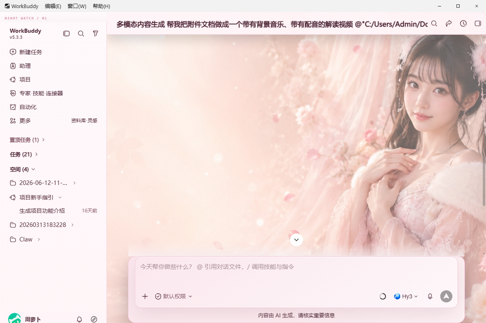
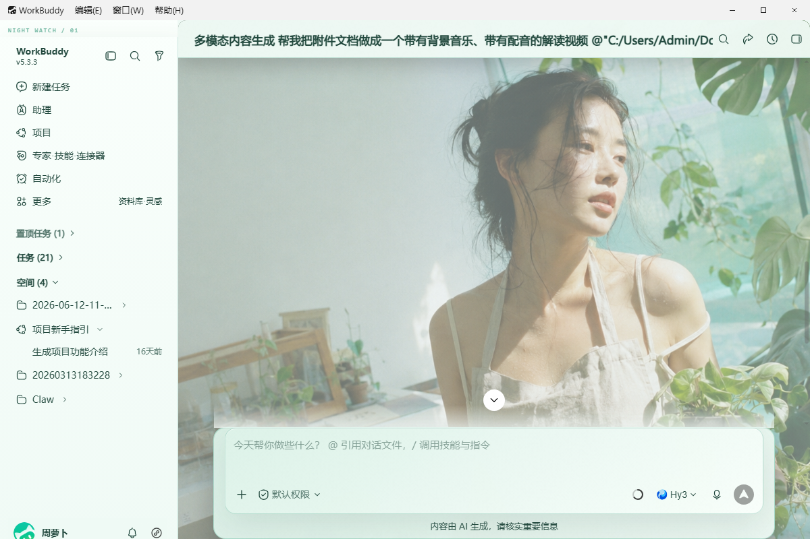
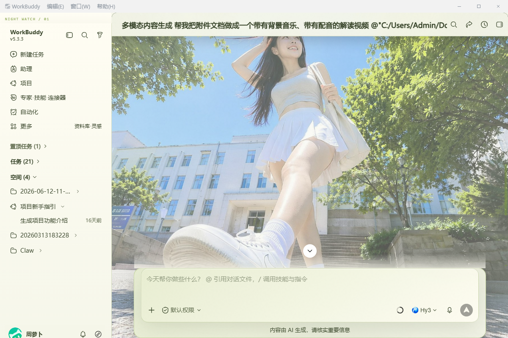
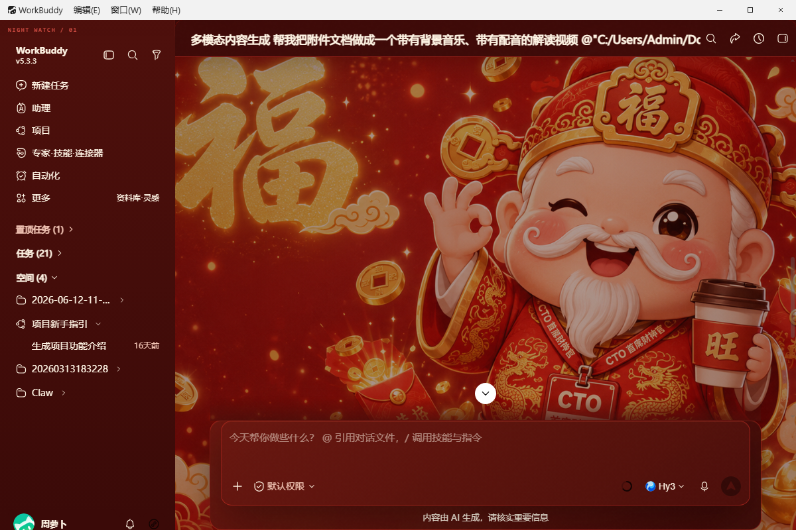
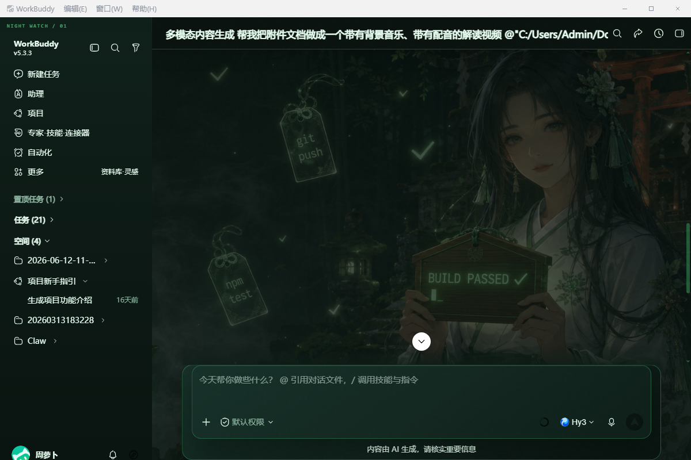

# WorkBuddy Dream Skin

Community, image-driven, fully reversible skinning for **Tencent WorkBuddy** on Windows.

> **Disclaimer.** This is an **unofficial community skin**. "WorkBuddy" is a trademark of **Tencent**; this project is **not** affiliated with, sponsored by, or endorsed by Tencent. "Codex" and related marks referenced via the upstream project belong to their respective rights holders. See [NOTICE.md](./NOTICE.md).

**License:** [MIT](./LICENSE). **Upstream:** design pattern adapted from [Fei-Away/Codex-Dream-Skin](https://github.com/Fei-Away/Codex-Dream-Skin) (MIT). **Asset provenance:** [CREDITS.md](./CREDITS.md). **中文版:** [README.md](./README.md).

---

## What it does

Drops a picture in, get a matching UI:

- **Palette matching** — analyses the image's hue and luminance, picks a light or dark theme, tunes accent / panel / text / muted tokens to match.
- **Layered background** — background image, hero visual, and a floating "decoration" card (the character portrait / badge in the top-right of the welcome page).
- **Fully live** — attaches to a running WorkBuddy process over loopback CDP; hot-reloads on theme change; re-injects itself after WorkBuddy navigates or reloads.
- **Fully reversible** — never touches `WorkBuddy.exe`, `app.asar`, signatures, or the WorkBuddy install directory. One command restores the stock UI.
- **Windows tray control** — refresh, switch themes, toggle decoration, import an image, restore.
- **Automated audit** — 7 headless audit gates (hover, composer, scenes, pages, details, settings, verify) capture screenshots and structured JSON so you can prove a theme still ships cleanly on a WorkBuddy update.

Current build: `0.7.6`. Verified against WorkBuddy `5.3.3` on Electron `37`.

## How it works (30-second version)

1. `start-workbuddy-skin.ps1` launches (or restarts) WorkBuddy with `--remote-debugging-port` bound to `127.0.0.1`.
2. A Node.js CDP client (`scripts/injector.mjs`) connects to the renderer target, validates it really is WorkBuddy (title + root selectors), and evaluates `assets/renderer-inject.js` in the page context.
3. That runtime installs one `<style>` and one `<div id="workbuddy-dream-skin-chrome">` under `<html>`, wires theme tokens through CSS custom properties, and re-hydrates on SPA route change or `Page.loadEventFired`.
4. There is no `npm install`. Node uses only its built-in APIs; PowerShell 5.1 ships with Windows.

## Built-in themes

| ID | Name | Look |
| --- | --- | --- |
| `deep-sea-layered` | Deep-Sea Night Watch | Ink blue / teal / dark panels |
| `gilded-night-banquet` | Gilded Night Salon | Classical figure, gold highlights, night scene |
| `sunlit-campus` | Sunlit Campus Notes | Campus photo, green highlights, polaroid decoration |
| `pink-dream-petals` | Rose Petal Daydream | Cherry pink, petals, airy light panels |
| `mint-bloom-studio` | Mint Bloom Studio | Mint green, leaves, airy light panels |
| `crimson-scifi` | Crimson HUD Deck | Red & white HUD, radar grid, black panels |
| `neon-hatsune` | Neon Idol Stage | Teal neon, pink accent, cyber floor |
| `violet-midnight` | Violet Nebula Hours | Nebula purple, star field, deep-night panels |
| `stage-blackgold` | Blackgold Keynote | Spotlight, gold trim, black stage |
| `fortune-crimson` | Cinnabar Fortune Hall | Cinnabar red, gold coins, lanterns, festive vibe |
| `zero-bug-shrine` | Green Build Shrine | Terminal green, torii vermilion, omamori, dev talismans (miko variant) |
| `zero-bug-shrine-maid` | Debug Catgirl Patrol | Terminal green + soft pink, catgirl terminal, hearts & nya~ (sweet variant) |
| `porcelain-bloom` | Porcelain Bloom Atelier | Pearl white, mint green, bright morning florist studio (bright) |
| `amber-nightlamp` | Amber Nightlamp Hour | Honey amber, cream white, warm satin lamplight (warm & bright) |

### Gallery

Captured against WorkBuddy `5.3.3`. The last tile is a live demo of the theme-owned decoration widget.

| Rose Petal Daydream (`pink-dream-petals`) | Mint Bloom Studio (`mint-bloom-studio`) |
| :---: | :---: |
|  |  |
| **Sunlit Campus Notes (`sunlit-campus`)** | **Cinnabar Fortune Hall (`fortune-crimson`)** |
|  |  |
| **Green Build Shrine (`zero-bug-shrine`)** | **Decoration widget (animated)** |
|  |  |

## Requirements

- Windows 10 or 11
- WorkBuddy desktop client (any recent build; `5.3.3` is the verified target)
- Node.js `>= 22`
- Windows PowerShell `5.1` or PowerShell `7`

## Quick start

Save your work in WorkBuddy first — the first-time enable restarts WorkBuddy with a debug port.

```powershell
# One-shot: sets ExecutionPolicy only for THIS process, not system-wide.
Set-ExecutionPolicy -Scope Process Bypass

cd <path-to-repo>\WorkBuddy-Dream-Skin
.\scripts\start-workbuddy-skin.ps1 -RestartExisting
```

Verify the injection landed and save an evidence screenshot:

```powershell
.\scripts\verify-workbuddy-skin.ps1 -ScreenshotPath .\artifacts\manual-verify.png
```

Switch to a shipped theme:

```powershell
.\scripts\switch-workbuddy-theme.ps1 sunlit-campus
```

## Custom theme from your own image

Simplest form — one image, auto-detect palette:

```powershell
.\scripts\customize-workbuddy-theme.ps1 `
  -ImagePath "C:\Users\<YourName>\Pictures\photo.jpg" `
  -Name "My Theme" `
  -SavePreset "my-theme"
```

Layered — background + hero + character:

```powershell
.\scripts\customize-workbuddy-theme.ps1 `
  -BackgroundImagePath "C:\Users\<YourName>\Pictures\bg.jpg" `
  -HeroImagePath        "C:\Users\<YourName>\Pictures\hero.jpg" `
  -CharacterImagePath   "C:\Users\<YourName>\Pictures\character.png" `
  -SavePreset "layered-theme"
```

Supported formats: PNG / JPG / WebP / GIF / SVG, up to 16 MB per file. Full schema is in [`docs/THEME-SCHEMA.md`](./docs/THEME-SCHEMA.md).

Style parameter picks the palette family: `Auto` (default, from image analysis), `Current` (keep colors, swap only the image), `PinkDream`, `MintBloom`, `SunlitCampus`, `GildedNight`, `DeepSea`. Any explicit color argument (`-Accent`, `-Background`, `-Panel`, …) overrides that field of the chosen palette.

## Tray

Install desktop / start-menu entries + auto-start the tray:

```powershell
.\scripts\install-workbuddy-skin.ps1 -StartNow -RestartExisting
```

The tray gives you: refresh skin, switch theme (with checkmark on the active one), toggle decoration, import / replace image, open the theme directory, restore stock UI, exit tray. Restoring the stock UI does **not** exit the tray, so re-enabling is one click away.

## Uninstall / restore

Just remove the skin from the running renderer:

```powershell
.\scripts\restore-workbuddy-skin.ps1
```

Restore stock UI and restart WorkBuddy normally:

```powershell
.\scripts\restore-workbuddy-skin.ps1 -RestartNormally
```

Also delete the desktop / start-menu shortcuts this project created:

```powershell
.\scripts\restore-workbuddy-skin.ps1 -RestartNormally -Uninstall
```

## Trust surface

1. CDP binds `127.0.0.1` / `::1` only — no external reachability.
2. The launch script verifies the port owner is the selected `WorkBuddy.exe`.
3. The injector accepts only local `file:` / `vscode-file:` renderer targets and re-checks WorkBuddy title + root selectors before evaluating anything.
4. Nothing writes to the WorkBuddy install directory. The skin lives in `%LOCALAPPDATA%\WorkBuddyDreamSkin`.
5. The decoration overlay uses `pointer-events: none` — it never intercepts input.
6. `restore-workbuddy-skin.ps1` only terminates injectors whose command line matches the recorded state file.
7. The Windows native title bar is *outside* the renderer DOM and cannot be themed with CSS. This is a hard limit of the approach.

See [`SECURITY.md`](./SECURITY.md) for the vulnerability-report channel.

## FAQ

**Q: Do I need to install anything besides Node.js and PowerShell?**
No. The Node.js side uses only built-in APIs (`ws`, `fs`, `path`, `crypto`, …); there is no `npm install`. PowerShell 5.1 ships with Windows.

**Q: Why `Set-ExecutionPolicy -Scope Process Bypass`?**
The scripts aren't code-signed. `-Scope Process` only affects the current PowerShell window — your system policy is untouched. Once you close the window, the setting is gone.

**Q: WorkBuddy launches but nothing gets themed.**
Confirm the CDP endpoint. `Get-Content $env:LOCALAPPDATA\WorkBuddyDreamSkin\state.json` should show a `port`. Curl `http://127.0.0.1:<port>/json/list` — the entry titled `WorkBuddy` means the target was found. If not, re-run `start-workbuddy-skin.ps1 -RestartExisting`.

**Q: The audit / verify hangs at "Page.captureScreenshot".**
The renderer's compositor is temporarily stalled. Minimize + restore WorkBuddy, or restart it from the tray. Confirmed cause on WorkBuddy `5.2.6` in some GPU states.

**Q: My theme looks fine in dark mode but breaks in light mode (or vice-versa).**
The palette needs to route text/panel through the `--wbds-text` / `--wbds-panel` / `--wbds-accent` tokens defined in `assets/style-palettes.json`, not through hard-coded hex. See [`docs/THEME-SCHEMA.md`](./docs/THEME-SCHEMA.md).

**Q: Can I use this on macOS or Linux?**
Not currently — the launch / restore / tray flow is PowerShell + Windows-only. The core injector (`scripts/injector.mjs`) is portable, so a POSIX front-end is theoretically doable; it's a "PRs welcome" item.

## Documentation index

- [PROJECT-STAGES.md](./docs/PROJECT-STAGES.md) — stage-by-stage implementation log
- [ARCHITECTURE.md](./docs/ARCHITECTURE.md) — runtime & data flow
- [DEVELOPMENT.md](./docs/DEVELOPMENT.md) — how to iterate locally
- [THEME-SCHEMA.md](./docs/THEME-SCHEMA.md) — full theme.json field reference
- [CHANGELOG.md](./CHANGELOG.md) — version history
- [ROADMAP.md](./ROADMAP.md) — open work

## Contributing

See [CONTRIBUTING.md](./CONTRIBUTING.md). Preflight passes (`npm run preflight`) are required for any PR. Please read the [Code of Conduct](./CODE_OF_CONDUCT.md) first.

## Known limits

1. Windows-native title bar and menu bar live outside the renderer DOM — cannot be themed.
2. Major WorkBuddy releases can rename selectors; run the full audit after upgrading.
3. Large chat pages sometimes trigger transient CDP timeouts on deep audits; a re-run confirms whether it's stateful.
4. Automated audit covers structure + contrast + interaction states, but ship-quality still needs a human eyeball on both light and dark themes.
